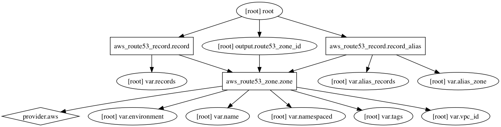

AWS Route53 Zone Terraform Module
=====================

Usage:
------

    module "route53_zone" {
      source         = "../tf_route53_zone"
      name           = "corp.com"
      environment    = "dev01"
      records        = ""
      alias_records  = ""
      alias_zone     = ""
    }

## Inputs

| Name | Description | Default | Required |
|------|-------------|:-----:|:-----:|
| alias_records | Map of DNS alias records | - | yes |
| alias_zone | The zone ID where origin zone is hosted | - | yes |
| environment | Environment (ex: dev, qa, stage, prod) | - | yes |
| name | Name | - | yes |
| namespaced | Namespace all resources (prefixed with the environment)? | `true` | no |
| records | Map of DNS records | - | yes |
| tags | A map of tags to add to all resources | `<map>` | no |
| vpc_id | AWS VPC ID | - | yes |

## Outputs

| Name | Description |
|------|-------------|
| route53_zone_id | AWS Route53 zone ID |

### Resource Graph

